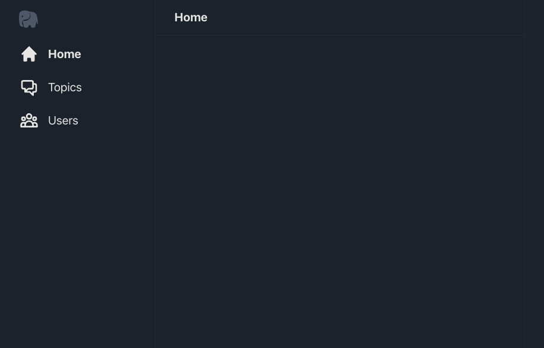

# Querying Arweave
On Arweave, new data is posted in the form of transactions. Each transaction has a set of headers and some bytes of stored data associated with it.  The data can be complete files, images, JSON, plain text, or encrypted data. The arweave nodes don’t care. They just store the raw bytes associated with a transaction and earn their fees/rewards by doing so.

If we had to sift through all the bytes on all the nodes in the network to find the ones we were interested in, it would be a painstaking task. Thankfully, arweave transaction headers are able to store up to [2048 bytes](https://docs.arweave.org/developers/server/http-api#transaction-format) worth of custom Tags.
## Tagging Transactions
Custom Tags are pairs of names and values. Things like “App-Name”:”Permamail” or “App-Version”:”0.1.0”. The arweave protocol doesn’t place many constraints on custom tags but there are some [suggested best practices](https://github.com/ArweaveTeam/arweave-standards/tree/master/best-practices) to help with consistency.

For our twitter-like dApp we’re only interested in transactions tagged with “App-Name” : “PublicSquare”. Each one of these transactions represents a post from a user we want to display in our timeline. So how do we go about it?

Arweave provides a simple way of querying for transactions by using tags. The https://arweave.net gateway exposes an endpoint for posting GraphQL queries to.  It also provides a playground for trying queries. 

[GraphQL](https://graphql.org/) is a flexible query language that services can use to build a customized data schema for clients to query. GraphQL also allows clients to specify which elements of the available data structure they would like to see in the results.
## Running a GraphQL query
To query arweave we’ll need to access it through a gateway that supports GraphQL. Let’s head over to the GraphQL Playground over at https://arweave.net/graphql. 

Copy and paste in the following query…
```
query {
  transactions(tags: [{
    name: "App-Name",
    values: ["PublicSquare"]
  }]) 
  {
    edges {
      node {
        id
        tags {
          name
          value
        }
      }
    }
  }
}
```
If you’re not familiar with GraphQL it can seem a little overwhelming at first but once you know the structure, it’s fairly easy to read and understand.

```query {<schema type>( <filter criteria> ){ <data structure of the results> }}```

In the example query we pasted our **schema type** is `transactions` but we could also query for `blocks`. A full description of Arweaves GraphQL schema is written up in the [Arweave GraphQL Guide](https://gql-guide.vercel.app/). The guide refers to the filter criteria as “Query Structures” and the complete data definition of transactions and blocks as “Data Structures”. 

When it comes to the structure of the results, the thing to note is that you can specify a subset of the complete data structure  you’re interested in. For example, the complete data structure for a transactions schema is [listed here](https://gql-guide.vercel.app/#full-data).

In our case we’re interested in the `id` and complete list of `tags` for any transaction matching our **filter criteria**.

Hit the big “Play” button in the middle of the playground to run the query.


You’ll notice we get back a list of transactions in the results data structure  we specified in our original query. 

If you’re new to blockchains this is unexpected, we haven’t built anything, why do these results exist? 
It turns out, the `“PublicSquare”:“App-Name”` tag we’ve filtered for has been in use for a while. 

[Arweave Team](https://twitter.com/arweaveteam) founder, Sam Williams, proposed the transaction format a few years ago in a [github code snippet](https://gist.github.com/samcamwilliams/811537f0a52b39057af1def9e61756b2). Since then builders in the ecosystem have been building on and round it, experimenting. 

By building this app we are also participating in that tradition.
Back to querying Arweave. You’ll notice in the GraphQL results that there are no readable post messages, just tags and information about posts.

This is because the GraphQL endpoint is concerned with retrieving properties of `transactions` and `blocks` but not their associated data. 

To get the data of a transaction we have to hit another HTTP endpoint.

```https://arweave.net/<transaction id>```

Copy and paste one of the `id`’s in your query results and modify the above link, appending the `id`. It should look something like this…

```https://arweave.net/eaUAvulzZPrdh6_cHwUYV473OhvCumqT3K7eWI8tArk```


The result of navigating to that URL in the browser (HTTP GET) would be retrieving the content of the post. In this example it’s…
```
Woah that's pretty cool 😎
```


Great, now we have the tools we need to start building. (For a complete listing arweave HTTP endpoints visit the [HTTP API documentation](https://docs.arweave.org/developers/server/http-api).)
## Getting started
In order to learn arweave we’ve created a simple react application using [create-react-app](https://create-react-app.dev/). For the purposes of this guide we’ll assume you’re familiar with react and able to inspect the various components to see how they are organized. If you need to brush up on React JS, completing the [React JS tutorial](https://reactjs.org/tutorial/tutorial.html) will get you caught up with any prerequisite info you need to complete this guide.

To follow along with this tutorial, clone a copy of the [public-square-app](https://github.com/DanMacDonald/public-square-app) template from github.
```
git clone https://github.com/DanMacDonald/public-square-app.git
```

This will create a /public-square-app directory that we can navigate into.
```
cd public-square-app
```


>Note: If you’d like to skip ahead to the finish line, the completed source for this sample project can be found in the finished branch on github.


Then we can run two commands, the first to initialize our projects dependencies, the second to start it up in developer mode.
```
npm install
npm start
```

The last command should have opened up a browser tab with the UI structure for our dApp, but with no data.



You can navigate around the user interface, but it’s pretty empty and inactive. In the next section we’ll figure out how to fix that.
## Querying from javascript
The first thing we’ll want is a query function we can call from anywhere in our app to retrieve data from arweave. Open the `src/lib/api.js` file and update the `buildQuery` function as follows. Later on we will make this `buildQuery` function dynamic and filter for different results.

```js
export const buildQuery = () => {
 const queryObject = { query: `{
   transactions(first: 100,
     tags: [
       {
          name: "App-Name",
          values: ["PublicSquare"]
       },
       {
          name: "Content-Type",
          values: ["text/plain"]
       },
       {
          name: "Version",
          values: ["1.0.1"]
       }
     ]
   ) {
     edges {
       node {
         id
         owner {
           address
         }
         data {
           size
         }
         block {
           height
           timestamp
         }
         tags {
           name,
           value
         }
       }
     }
   }
 }`}
 return queryObject;
}
```

If you’re paying attention you’ll notice that we’ve added a new filter criteria to the `tags` section. We’re now additionally looking for a  `"Content-Type"` tag with the value `"text/plain"` and a `"Version"` tag with the value `"1.0.1"` on the `transactions` returned by our query.

Why add this additional filter criteria? Well, it turns out we aren’t the only ones piggybacking on this Public Square protocol. Other developers have as well and they’ve taken it in different directions. One of the most common ways developers extend the protocol is by turning the post format into JSON (instead of plain text) and embedding more structured data into the posts transaction data.  When they do that they change the `"Content-type"` tag to `"text/javascript"`.

It also helps with graphQL query performance to be as specific as possible with tag filters.

To keep our tutorial simple we’re only going to deal with posts that have a `"Content-type"`  of `"text/plain"`. What other content types are there? By convention the `"Content-type"` tag follows the MIME types standard. You can find a list of [Common MIME types](https://developer.mozilla.org/en-US/docs/Web/HTTP/Basics_of_HTTP/MIME_types/Common_types) here.

We’ve also added a bit more data to our results data structure. We’ll see what that data is needed for shortly.

Good! Now we have a javascript function that initializes a query for us, but how do we post it to the gateway to get results?

| Previous | Next |
| -- | -- |
| [Overivew](README.md)| [02 Integrating Arweave-js](02-IntegratingArweaveJS.md#integrating-arweave-js)
