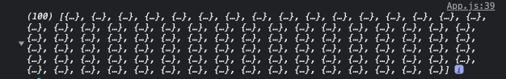
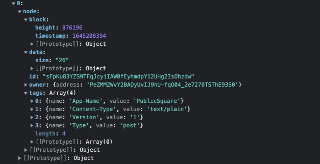
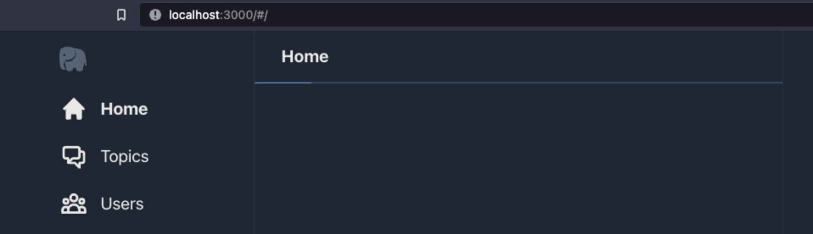
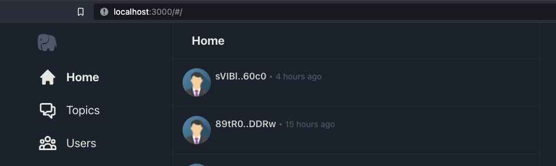
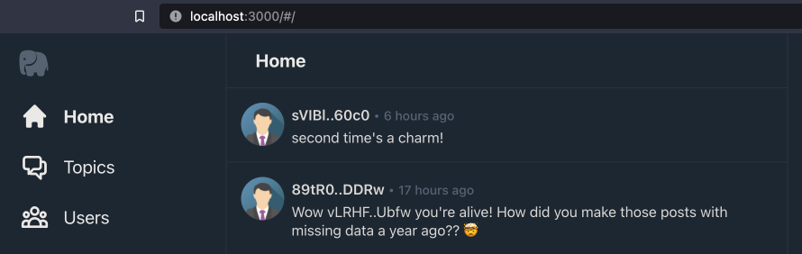
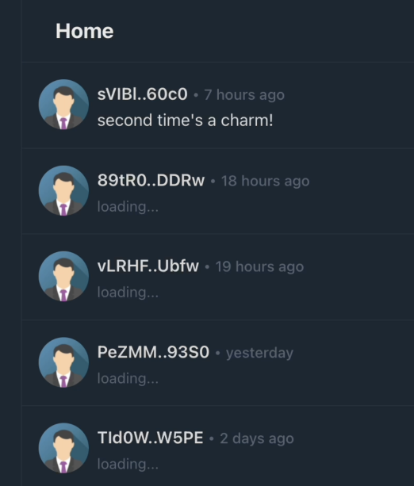
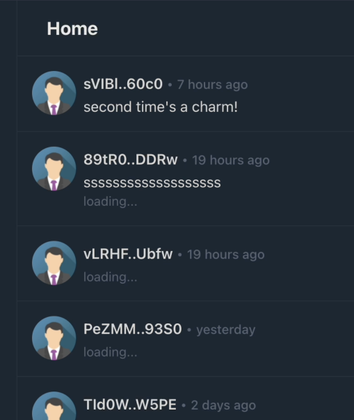

# Integrating Arweave-js
First we’ll want to install the `arweave-js` package from npm.
```
npm install --save arweave
```

You can read more about the structure of arweave data and the features of `arweave-js` in its [readme on github](https://github.com/ArweaveTeam/arweave-js). For now, we only need two lines of code to begin interacting with arewave.
Open up the `src/lib/api.js` file in our sample project and add the following lines right at the  top of the file.
```js
import Arweave from 'arweave';
export const arweave = Arweave.init({});
```

This will create an instance of the arweave api object with default configuration pointing to the https://arweave.net gateway. Initializing arweave in a single location in your codebase and then referencing it from elsewhere will make it easier to point your app at different environments or gateways in the future.
## Querying the gateway
Now let’s head over to `src/App.js`.

First thing is to import our arweave instance and buildQuery() function with the following import.
```js
import { buildQuery, arweave } from './lib/api';
```

Then edit the `getPostInfos()` function to look like this.
```js
async function getPostInfos() {
 const query = buildQuery();
 const results = await arweave.api.post('/graphql', query)
   .catch(err => {
     console.error('GraphQL query failed');
      throw new Error(err);
   });
 const edges = results.data.data.transactions.edges;
 console.log(edges);
 return [];
}
```

Here we use the `arweave-js` package to post a GraphQL request to the default gateway’s graphql endpoint (https://arweave.net/graphql) and await the response.

For now we’ll just return an empty array so as not to confuse the rest of the sample project code. What we’re interested in is what we’re getting back from arweave and what it looks like in javascript.

Refresh the browser tab where the dApp is displayed and take a look at the developer console in the browser.

If you stopped React’s live development mode when you installed `arweave-js` you can restart it now by typing the following in the root of the  project directory.
```
npm start
```

When the site loads you’ll see something like this in the browsers developer console.



If you expand the first element fully you’ll see the data structure we requested in our query is reflected by the results.



An important note…
>We’re getting 100 results from our GraphQL query  because we specified `first: 100` in the filter criteria. If you omit this criteria, the **gateway defaults to returning 10 results**.
100 results also happens to be the maximum number of results the gateway will return per query request. You can read more about results [pagination and cursors](https://gql-guide.vercel.app/#pagination) here.

Okay! Let’s start binding these to our view components. The sample project components expect each post's data to be organized in a specific way, but instead of having you guess what that might be, the sample project includes a function that converts the `node` objects we got back from our GraphQL query into `postData` objects.

Open up `src/lib/api.js` again and let's take a look at the `createPostInfo` function.
```js
export const createPostInfo = (node) => {
 const ownerAddress = node.owner.address;
 const height = node.block ? node.block.height : -1;
 const timestamp = node.block ? parseInt(node.block.timestamp, 10) * 1000 : -1;
 const postInfo = {
   txid: node.id,
   owner: ownerAddress,
   height: height,
   length: node.data.size,
   timestamp: timestamp,
 }
 return postInfo;
}
```

While this looks like your basic input validation, there’s actually a fair amount of arweave specific details represented here.

* `node.owner.address` is the address of the wallet that posted the transaction and the way to uniquely identify users/wallets on arweave.

* If `node.block` is non null it means we have a block height for the block the transaction was mined in. If `node.block` is `null` it means that this transaction is not mined yet. Instead, it is a  **pending transaction**. Pending transactions are those that have been posted to arweave for mining but are waiting in what’s known as the “mempool” for miners to include them in a block. Occasionally pending transactions are dropped. This can happen for a number of reasons, but the important thing to know is that **after 30 blocks have passed a pending transaction is dropped**. This means the user will have to try to post their data to arweave again. Hopefully correcting anything that might have been wrong the first time.

* Each block has a **unix timestamp** for the time it was mined. This is handy for us to tell roughly when a post was made. The arweave network attempts to mine blocks every 2 minutes. Still that’s good enough for us to tell roughly when a post originated. The thing to note here is that javascript timestamps are the number of milliseconds since 1970 and unix timestamps are the number of seconds. **This means we must multiply arweave block timestamps by 1000 before using them in javascript Date functions!**

* One of the nice things about the transaction headers is that they know the number of bytes of data associated with them. Even if GraphQL can’t return the actual transaction data directly we know from `node.data.size` how many characters/bytes it is. We’ll use this to our advantage later in a UI optimization.

Ok, now that we know how this function is mapping GraphQL data to our postInfo items, let's wire it up in our `getPostsInfos()` function back in `src/App.js`.

First update our import statement  to include `createPostInfo`.
```js
import { buildQuery, arweave, createPostInfo } from './lib/api';
```

Then, replace `return [];` at the end of `getPostInfos()` with the following line of code. 

```js
return edges.map(edge => createPostInfo(edge.node));
```

If it’s been a while since you’ve used the `map()` function on an array, don’t worry, it’s just a concise way of converting our array of `edges` into an array of `postInfo` items. The `map()` function will visit each element in the edges array and pass it  to `createPostInfo()`. In this case we only want to pass the node property of each `edge`, not the full `edge` object. The `map()` function then replaces whatever item was in the `edges` array with whatever is returned by `createPostInfo(edge.node)`.

We could have just used the `edges` array directly, but by converting it to an array of `postInfo`’s items we have a nice data model for posts that will simplify the logic in our view components.

## Managing state with React
Over in React land, keep the `src/App.js` file open and let's start adding some React state.

Add the following two lines to the start of the `App()` function.  Thus let React know we’re going to store this state at the application level.
```js
const [postInfos, setPostInfos] = React.useState([]);
const [isSearching, setIsSearching] = React.useState(false);
```

* The `postInfos` state is where we’ll keep our array of `postInfo` items. React is smart enough to only rebind views that use those items if the underlying data changes. By storing it at the application level it allows us to navigate around to other areas of the UI without unloading our `postInfos`. While the gateway could probably handle us querying the gateway every time the timeline was viewed, why not build in a little caching and be good arweave ecosystem participants?

* `isSearching` is a state flag we’ll use to control visibility of a loading spinner that will show while our query is running. It’s a nice touch to let the user know that something is happening. This is important when the user is connecting over a slow connection.

It’s time to execute our `postInfos` query. To do that we’ll use React's `useEffect()` method. Modify the `useEffect()` code below the two lines we just added to look like the following.
```js
React.useEffect(() => {
   setIsSearching(true)
   getPostInfos().then(posts => {
     setPostInfos(posts);
     setIsSearching(false);
   });
 }, [])
```

First let’s take a quick look at `useEffect()` as it’s a relatively recent addition to React. Its usage is as follows.

```useEffect(<function to execute>, [<state items that trigger re-executing the function>]}```

* The **function to execute** is the work we want done by `useEffect()`.
* The second argument is an array of state variables (like the `postInfos` and `isSearching` variables we initialized with `useState()` ). If we don’t provide the second argument, `useEffect()` will run the **function to execute** every time the `<App />` component renders. This would be horribly spammy and would result in overlapping asynchronous network requests that would be quite the mess to sort out.  Thankfully, we can provide an empty array to this argument, telling `useEffect()` to only run the **function to execute** when the parent component is mounted. 

Scroll down a little to the `<Routes>` section of the App components code. Here we’ll modify the <Home /> component and pass in our new state properties. The resulting code should look like this.
```js
<Home
  isSearching={isSearching}
  postInfos={postInfos}
/>}
```

It’s time to modify the implementation of the Home component in our `src/App.js` file. 

Locate the section starting with `const Home = (props) => {` and right below the `<header>Home</header>` line, add the following two lines of code.

```js
{props.isSearching && <ProgressSpinner />}
<Posts postInfos={props.postInfos} />
```

This will accomplish two things. 

The first is to include our `<ProgressSpinner>` component. This is a simple CSS based spinner animation that we toggle on and off based on the `props.isSearching` state variable.

The second is to include a `<Posts />` component that knows how to render an array of `postInfo` items. The `<Home />` component then acts as a passthrough, handing off the `postInfos` it received to the `<Posts />` component. It’s fine for now that you don’t understand how the `<Posts />` component works. We’ll dive into that later when we start requesting the transaction data for each post.

Head back over to the browser tab containing and hit refresh. You should see two things. The first is a progress spinner…



Followed by…



This is nice, but it seems like something is missing. Ah yes, the actual content of the posts!

This leads us to our next Arweave concept.

# Retrieving transaction data
Head back to our `createPostData` function in `src/lib/api.js` again. Edit the last few lines of the function to be the following… 

(adding a request property to the post info declaration, and then assigning an arweave request to it before returning the object)
```js
   request: null,
 }
 postInfo.request = arweave.api.get(`/${node.id}`, { timeout: 10000 })
   .catch(() => { postInfo.error = "timeout loading data"});
 return postInfo;
}
```

What we’ve done is to add a `request` property to our `postInfo` instance we’re initializing,  and then assigned the promise returned by `arweave.api.get()` to it.

You’ll notice that we also `catch()` any error in our request and store it on an error property we dynamically add to our `postInfo`. This will help us down the road in our `<Post />` component, to discover if this transaction data request succeeded or failed.

>It should be noted that the React way of doing this would be to have another `useEffect()` in each `<Post />` view component to retrieve the transaction data for that view. However, `useEffect()` only executes after the component is mounted (visible) on the page. This would lead to a situation where the post would first be visible on the page, then the `useEffect()` would fire to start loading the transaction data for the post.
>
> Instead of taking that approach we’re relying on the fact that these postInfo’s are stored at the application level and persist until updated. This means we can kick off loading the transaction data right away before mounting or displaying any `<Post />` components. This will make some performance optimizations possible later on that will make the user experience feel smooth and polished. I have an axiom. If you have to choose between the “right way” and the better user experience, always choose the better user experience.

Okay, with that out of the way let’s see what’s showing up in our dApp.



Hey look at that, post messages are showing up. But how?

## Binding transaction data
React’s use of components leads to a very modular application architecture and is one of its core strengths. The sample project includes a `<Posts />` component that gets reused in a number of pages/routes. It’s time for us to dive into `src/components/Posts.jsx` and see what’s going on.

The first thing to note is that our `<Posts />` component just takes the array of `postInfos` passed in via `props` and uses the `map()` function again.  Except this time `map()` is converting each `postInfo` item in `postInfos` to `<PostItem />` view components for react to render!
```js
export const Posts = (props) => {
 return (
   <div>
     {props.postInfos.map(postInfo =>
       <PostItem key={item.txid} postInfo={postInfo} />
     )}
   </div>
 )
};
```

When a component has a collection of child components like we do here, React prefers if we provide a unique `key` property to help it keep the children sorted in a consistent order. Luckily for us, our `postInfo` items have the `txid` property (transaction id).  This transaction id is guaranteed to be unique for every transaction on arweave and fills the role of a unique key nicely.
## Optimizing view components
It’s time to take a look at the `<PostItem />` view component.
```js
const PostItem = (props) => {
 const [postMessage, setPostMessage] =
   React.useState('s'.repeat(Math.max(props.item.length - 75, 0)));
 const [statusMessage, setStatusMessage] = React.useState("");
```

Okay, already there are some interesting things going on here. 

First off we have two React states, `postMessage` and `statusMessage`. Nothing unexpected there, but what's this weird initialization of `postMessage` to have a bunch of ‘s’ characters? 

Let’s take a look.

To understand what's going on, let’s initialize the postMessage with an empty string.
```js
  const [postMessage, setPostMessage] = React.useState("");
```

Now watch carefully as our app loads up after hitting the refresh button in the browser. 
>You may need to refresh a few times to observe the effect. 
>
>If you’re not seeing the visual popping, try doing a “hard refresh” in your browser. 
>
>Past page loads may have caused the post data to be cached such that the browser has the data locally and doesn’t make a network request to retrieve it.  This can often be accomplished using shift+f5 or right clicking on the refresh button and looking for a “refresh + clear cache” option.


| While Loading | Loading Complete|
|--------|------|
|||

Notice how the post with two lines of text pushed all the other posts down a little after its post message loaded?? The more multiline posts visible, the more the posts will appear to jump around as the page loads. (you can observe the effect the most clearly by comparing where the avatar image is before and after loading, anything below the two line post gets pushed down in the view)

Now let’s restore the optimization.
```js
  const [postMessage, setPostMessage] =
   React.useState('s'.repeat(Math.max(props.item.length - 75, 0)));
```

And see the difference…

| While Loading | Loading Complete|
|--------|------|
|||

The thing to note here is that the problematic two lines post now has two lines of text while loading. The repeated ssssss characters and the "loading…" status message. The additional line provided by the ssssss characters enables the post to have the same vertical extent before and after the message is loaded.  This dramatically reduces the visual popping that occurs without the optimization.

Our optimization assumes that the line length of a post is approximately 75 characters, so the number of ‘s’ we add is roughly equivalent to the number of characters on the 2nd line of our two line post. There are a number of other approaches that may be more correct than printing padding ‘s’ repeatedly. In practice, though, I found the loading state was only visible for a frame or two before being replaced by actual data. Having the vertical extent of the post be correct during loading had a far greater effect on the perception of pop in.

The cool thing about this optimization is that it was enabled by the fact that we know the number of characters in a post’s message data before we retrieve it from arweave! All thanks to the `node.data.size` we queried via GraphQL back in Querying from Javascript.

But wait, there’s one more optimization we can do here. 

Remember how we initiated the get transaction data request in `createPostInfo()` ? What if we gave that request a small amount of time to complete loading before displaying the posts?

Head back to `src/App.js` and modify the last line of `getPostInfos()` to look like this.
```js
return await delayResults(100,edges.map(edge => createPostInfo(edge.node)));
```

The `delayResults()` function is defined in `src/lib/api.js`. If you’re using a good javascript editor like VSCode (and you typed this in manually, instead of copy+pasting it), it should have auto-imported the reference for you. The first parameter is the number of milliseconds to delay before returning.  In this example I’ve chosen to delay 100 milliseconds. On my computer this is another dramatic improvement in loading visuals, removing the perception of things popping in almost entirely.

This is the advantage we were trying to gain by not waiting until the `<PostItem />` components were mounted and visible to start loading their data!

With that done, it’s time to get back into the `<PostItems />` components `useEffect()` call. 

This is the densest chunk of code in the whole program so if you can learn this bit, it’s smooth sailing from here.

## Handling asynchronous state
The purpose of this `useEffect()` in the `<PostItem />` component is to await the transaction data request we initiated in `createPostInfo()` (in the [Retrieving transaction data](#retrieving-transaction-data) step). This is the densest logic we’ll cover in this guide, so we’ll take it step by step.

First off we have some local variables to track changes to the status and post messages that our `<PostItem /> `component renders.
```js
React.useEffect(() => {
  let newPostMessage = "";
  let newStatus = "";
```

Why not just use the `postMessage` and `statusMessage` variables we defined for our React state?

To answer that we have to take a step back and talk about some of the pitfalls of asynchronous network calls. This `useEffect()` executes when the `<PostItem />` component is loaded but the component may be unloaded at any moment if the user navigates to a different area of the UI and the component is removed from the view.

In this case of an unloaded component, if our `useEffect()` function tries to invoke `setPostMessage()` or `setStatusMessage()` to update the React state, it will result in a memory leak that React will complain bitterly about in the developer console.

So, we only want to update our React state if the `<PostItem />` component is still mounted and in use. We’ll see how to do that in a moment, but for now we’ll avoid updating the React state directly and track any changes to our posts status or message in local variables.

Next, we’ll want to do work only when the `item.message` property is undefined. This is true the first time `useEffect()` executes as the `<Post />` component is mounted.
```js
if (!props.item.message) {
 setStatusMessage("loading...");
 let isCancelled = false;
 
 const getMessage = async () => {
   const response = await props.item.request;
   if (!response) {
     newStatus = props.item.error;
   } else if (response.status && (response.status === 200 
     || response.status == 202)) {
     props.item.message = response.data;
     newStatus = "";
     newPostMessage = response.data;
   } else {
     newStatus = "missing data";
   }
 
   if (isCancelled)
     return;
   setStatusMessage(newStatus);
   setPostMessage(newPostMessage);
 }
 
 getMessage();
 return () => isCancelled = true;
}
```

The first thing we do is use the `setStatusMessage()` React state function to set a "loading…" status. Because this will happen the very first time the component is displayed (mounted) we don’t have to worry about setting React state on an unmounted component.

Next we need to expose a means for React to cancel our `useEffect()` call if the component is unmounted while `useEffect()` is in progress. To do that we set a control variable
```js
let isCancelled = false;
``` 

Next we declare an `async` `getMessage()` function. React’s `useEffect()` functions are not `async` themselves but declaring an inner `asyn`c function this way lets us write code that utilizes async calling semantics. This enables us to use `await` which improves readability by reducing the telescoping effect of using promise-style  `.then()`‘s repeatedly.

The first thing we do in `getMessage()` is to 
```js
const response = await props.postInfo.request`
```
This` props.item.request` may or may not have been completed before `useEffect()` is executed, but in either case we won’t move to the next line until we have a completed request.

When we created this item.request back in the [Retrieving transaction data](#retrieving-transaction-data) step, we also added a `.catch()` to handle any errors. If an error happened during the request, the value of response would end up being `undefined` and the error text would be stored in `item.error`.

So an error is the first thing we check for with `if (!response) {` and we store the error message in our local `newStatus` variable.

Next  is our valid case. We have a response and it has a status of 200 (the [HTTP Status code](https://developer.mozilla.org/en-US/docs/Web/HTTP/Status) for success) or in the case of a pending data a status of 202.

In this case we add a new property with  
```js
props.postInfo.message = response.data;
``` 
and we stuff the response data (post message) into it. If the `useEffect()` executes again and we already have the message we won’t have to do all this work again, Once we have the post message in hand, we no longer want to display the “loading…” status text in the `<PostItem /> `so we set our newStatus to an empty string.

We also update our `newPostMessage` local variable with the post message.
In the final else case, we set `newStatus = "missing data";` , in this case our request completed without error but the gateway returned something other than a 200 (success) status code. In almost all cases what is actually returned is a status code of 404 (the [HTTP Status code](https://developer.mozilla.org/en-US/docs/Web/HTTP/Status) for missing) meaning it couldn’t locate the data.

How can data be missing on Arweave? Isn’t data on arweave permanent?

Good question to ask, this situation can arise when someone posts a transaction but fails to upload the data (or the upload is interrupted). In this case the network may contain partial data or no data for a given transaction. Arweave supports re-uploading the data if an upload is interrupted and the nodes are incentivized to receive this data because it may be used when mining new nodes. A nice feature of arweave is you only pay for the first transaction, once the transaction is mined you are free to re-upload any missing data without any additional cost.

All right! We’re to the last bit.
```js
   if (isCancelled)
     return;
   setStatusMessage(newStatus);
   setPostMessage(newPostMessage);
```

First we check to see if our `useEffect()` has been canceled or not. If it has, we simply return making no React state changes and avoiding memory leaks. If not, we go ahead and push our local `newStatus` and `newPostMessage` variables into the react state to update the view.

But how do we know if we’ve been canceled or not? Who sets isCancelled to true?

Great question.

Other than calling our `getMessage()` function to manage the loading of the post message. The last thing `useEffect()` does is…
```js
return () => isCancelled = true;
```

By returning a function from `useEffect()` we are giving React a way to cancel our `useEffect()`. This simple return arrow function will set our `isCancelled` to `true` and make sure `getMessage()` never tries to update the React state of the component after it is unmounted.

That’s it! You’re through the most complex code you’ll see in this guide. You now understand how the transaction data containing the post message is making it into the Post components.

Now onto some exciting functionality.

| Previous | Next |
| -- | -- |
| [01 Querying Arweave](01-QueryingArweave.md#querying-arweave) | [03 Posting Transactions](03-PostingTransactions.md#posting-transactions)