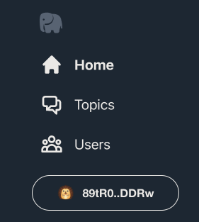

# Posting Transactions
Before we can post a new transaction to the arweave network it needs to be signed by a users private key. Indeed, it is this signature that is used to drive the transaction id for the transaction to be3 posted with.

In order to sign a transaction securely without exposing the users private key to our application code we use something called a "wallet".

## Connecting to a wallet
So the next thing to dive into would be making new posts, but in order to do that users need to be able to sign transactions. To sign transactions securely we need to add wallet support.
> Arweave transaction signatures are a cryptographic way to prove that a public and private key pair is the true originator of the transaction. The signing process appends all of the relevant headers from the transaction, generates a hash of that data, and then signs that hash using the wallets private key. Cryptographically this means anyone can check the signatures validity by calculating the hash from the headers and then verifying the signature of that hash with the signer's public key. In this way it is not possible to “spoof” a transaction as originating from another wallet.
>
>An RSA signature is a 512byte key, but when we  take the SHA-256 hash of that, we get the transaction id. This means it’s not possible to know a transaction's id until it’s been signed.


In this section we’ll learn about two arweave wallets. [ArConnect](https://arconnect.io) and [arweave.app](https://arweave.app). These two wallets share the same purpose of preventing our application from ever seeing the user's private key, all while enabling the user to perform functions like sign, verify, decrypt and encrypt information within our app.

What’s interesting is that ArConnect and arweave.app use differing approaches to accomplish this shared purpose. ArConnect operates similarly to MetaMask (if you’re familiar with it) and is a browser extension you [download from the chrome store](https://chrome.google.com/webstore/detail/arconnect/einnioafmpimabjcddiinlhmijaionap). Once installed this extension will inject some code into each page you visit to enable it to talk to the plugin.

Arweave.app is a web wallet, which means it’s just some code running in another tab in your browser. Because it’s not a plugin, it doesn’t have permissions to inject code into the app so if we are to support it, we have to add the supporting code ourselves.

A little more work for us, but less work for the user — who doesn’t have to first install a plugin to sign into the app.

Let’s start off with the ArConnect wallet integration. After you’ve installed the browser plugin there’s not much to do on the app side. In order to save you having to build a bunch of components to support the wallet flow, the project template implements one for you.

Head over to the `src/App.js` file and let's add some state. Any number of components could want to know if the user is signed in or not so it makes sense to store a flag at the `<App />` component level to indicate if the user has connected a wallet or not.

Add the following line to the start of the `App()` function.
```js
const [isWalletConnected, setIsWalletConnected] = React.useState(false);
```

This should appear right above the two other `useSate()` lines we added for `postInfos` and `isSearching`. Now scroll down to where the `<Navigation />` component appears in the file and add in the following line.
```js
<WalletSelectButton setIsConnected={() => setIsWalletConnected(true)}/>
```

You should now see a big “Select Wallet” button appearing below the left navigation in the app.


And when you click on it you should be prompted to sign in with either ArConnect or arweave.app wallets.


Open up the `src/components/WalletSelectButton.jsx` and locate the `connectWallet()` function. Inside you’ll see a switch statement with a case for `AR_CONNECT`. Add the following line to initialize ArConnect.
```js
await window.arweaveWallet.connect(['ACCESS_ADDRESS','SIGN_TRANSACTION','DISPATCH']);
```

When ArConnect is active in your browser, it exposes itself on the `window.arweaveWallet` object. When connecting to ArConnect we can request the permissions we would like our users to have while using the dApp. In our case we’d like access to the users wallet address and the ability to sign transactions. There are a number of other [wallet permissions](https://docs.th8ta.org/arconnect/permissions) we can ask for, but we only need these two for our dApp.

Go ahead and try it out, you should see something like this after clicking the ArConnect option from our wallet picker modal.


Upon logging in to ArConnect you’ll see the following prompt.


You can see that ArConnect is asking the user for the same permissions we asked of it in our code. Click Accept to allow the dApp to perform these actions.



Once signed in you should see the “Select Wallet” button has been replaced with a button showing the address we signed in with and the ArConnect hedgehog icon.

That was easy, now let’s do the same for the arweave.app web wallet.

Remember how I said that arweave.app couldn’t just inject itself into the page? That means we have to inject the bindings ourselves. Thankfully the arweave.app provides an npm package for just that purpose. Run the following command to install the package.

```
npm install arweave-wallet-connector
```

Now, somewhere at the top of the `src/components/WalletSelectButton.jsx`  add the following import. 
```js
import { ArweaveWebWallet } from 'arweave-wallet-connector';
```

Also somewhere at the top of the file add the following initialization for arweave.app.

```js
const webWallet = new ArweaveWebWallet({
 name: 'PublicSquare Tutorial',
 logo: 'https://jfbeats.github.io/ArweaveWalletConnector/placeholder.svg',
}, 'arweave.app');
```

This initializes a wallet connector instance for us to interact with. It can be configured to have a custom icon, but for now let’s go with a placeholder.
Now, down in the `connectWallet()` function, it’s time to implement the arweave.app wallet connection.  Go to the switch statement and add the following lines to the `ARWEAVE_APP` case.

```js
await webWallet.connect();
webWallet.on('change', () => { if (!webWallet.address && props.onDisconnected) props.onDisconnected(); })
```

Listening to the `'change'` event on the webWallet enables us to detect the case when the user disconnects from our dApp by closing the connector popup. 

The final `connectWallet()` function will look like this…

```js
async function connectWallet(walletName) {
 switch(walletName) {
   case AR_CONNECT:
     await window.arweaveWallet.connect(['ACCESS_ADDRESS','SIGN_TRANSACTION','DISPATCH']);
     break;
   case ARWEAVE_APP:
     await webWallet.connect();
     webWallet.on('change', () => { if (!webWallet.address
       && props.onDisconnected) props.onDisconnected(); })
     break;
   default:
     throw new Error(`Attempted to connect unknown wallet ${walletName}`);
 }
 props.onConnected(walletName);
 props.onClose();
}
```

It’s time to test it out, after clicking the arweave.app option in the wallet picker modal you should see the wallet connector pop up. The ">a" icon in the top left is the placeholder icon we specified but we could have just as easily specified one specific to our project.


Once clicking the large “Connect” button at the bottom  to confirm the connection, you’ll see the “Select Wallet” button in the nav has been replaced with a signed in version.


So what can we do with these wallets now that it’s possible to sign in? 

Conveniently both wallets listen to events on the global `window.arweaveWallet` instance.

* For arweave.app the [supported wallet actions](https://github.com/jfbeats/ArweaveWebWallet/blob/master/src/providers/Arweave.ts#L84-L153) can be found on github.
* The same is true for ArConnects’ [arweaveWalelt api](https://github.com/th8ta/ArConnect/blob/development/types/index.d.ts#L9-L138).

For the most part the two wallets support identical interfaces via `window.arweaveWallet`, enabling you to write your code once and have it work seamlessly with either wallet. The one exception is around the `encrypt()` and `decrypt()` functions, but I expect this divergence will be reconciled in the future.

Oh, importantly, the `arweave-js` package knows how to integrate with the `window.arweaveWallet ` reference to implement its api.

## Creating a new post

With that, we’re ready to enable the user to make new posts to the public square.
The sample project code provides a React component to get us started. Open up src/App.js and locate the Home component. Right below the line `<header>Home</header>`, add the following component declaration.

```js
<NewPost />
```

Your editor should automatically add…

```js
import { NewPost } from './components/NewPost';
```

... to the top of src/App.js but if it doesn’t, you can manually add it yourself.
Now when you refresh the site in your browser  you should see something that looks like this.


Now, try connecting with your wallet.

Same thing. Nothing really changes in the IU.

That’s because the `<NewPost />` component doesn’t know about our signed-in state! Good thing we’re tracking that at the App component level already. All we have to do is pass it as a prop to `<NewPost />`. Here’s how that would look…starting with `<Home />`

```js
<Home
 isWalletConnected={isWalletConnected}
 isSearching={isSearching}
 postInfos={postInfos}
/>
```

First we add an isWalletConnected property to our `<Home />` component declaration in the App component by adding the line `isWalletConnected={isWalletConnected}`. This passes the `isWalletConnected` state to `<Home /> `so we can then pass it through to `<NewPost />`
Next,  modify `<NewPost />`‘s declaration this way.
```js
<NewPost isLoggedIn={props.isWalletConnected} />
```

Now when you connect your wallet the UI changes to display an area to input post data.


And when you type the “Post” button lights up…


But when you click it, nothing happens.

That’s because we haven’t implemented the on click logic to post a transaction. Let’s do that now.

Open `src/components/NewPost.jsx` in your editor. First off, let’s go over the react state variables the `<NewPost /> `component is using.

```js
const [postValue, setPostValue] = React.useState("");
const [isPosting, setIsPosting] = React.useState(false);
```

You can dig into the implementation if you’re inclined, but all you really need to know is that 
* The text the user types into the textarea is stored in `postValue`
* We can set a flag, `isPosting`, to enable or disable input on the interactive elements.. Disabling input on post provides visual feedback to the user that the post has been submitted. It also prevents them from hitting the “Post” button multiple times, potentially posting duplicate posts unintentionally.

## Dispatching a Transaction
At long last,  it’s time to implement the `onPostButtonClicked()` function and send a transaction to arweave. We do that by adding the code below, don't worry about the commented out line, we'll come back to it later in the tutorial.
```js
async function onPostButtonClicked() {
   setIsPosting(true);
   let tx = await arweave.createTransaction({ data:postValue })
   tx.addTag('App-Name', 'PublicSquare')
   tx.addTag('Content-Type', 'text/plain')
   tx.addTag('Version', '1.0.1')
   tx.addTag('Type', 'post')
   try {
     let result = await window.arweaveWallet.dispatch(tx);
     setPostValue("");
     // setTopicValue("");
     if (props.onPostMessage) {
       props.onPostMessage(result.id);
     }
   } catch (err) {
     console.error(err);
   }
   setIsPosting(false);
 }
```

First we add the tags that conform to the [Public Square](https://gist.github.com/samcamwilliams/811537f0a52b39057af1def9e61756b2) protocol. Then we attempt to `dispatch()` our transaction via the global `window.arweaveWallet` reference. We have to check two cases here.
* First we need to catch any error that occurs. For example:
  * The connected wallet does not define a `dispatch()` function.
  * The wallet prompts the user to perform the `dispatch()`  and the user rejects.
  * The user disconnects the wallet during the operation.
  * … and other cases are more difficult to anticipate.
* The success case is then the wallet returns us a result object with the following schema. 

A `BASE` transaction is posted directly to arewave as an L1 transaction. `dispatch()` will first attempt to post the transaction via [bundlr.network](https://bundlr.network/https://bundlr.network/) L2 (denoted with a type: `BUNDLED`) which guarantees the transaction will be mined and has data availability after a few seconds. 

Finally in response to a successful `dispatch()` of a transaction, we reset the input fields on the New Post form and re-enable the input elements.  Otherwise, in the case of an error we make the input fields editable again but leave the contents in them to allow them to try again if they so choose.

Awesome, now we can make new posts to the public-square. The feed doesn't automatically refresh yet, we'll get to that in [part 5](05-PolishingAndDeploying.md), but first we're going to implement account names and profile images!

| Previous | Next |
| -- | -- |
| [02 Integrating Arweave-js](02-IntegratingArweaveJS.md#integrating-arweave-js)| [04 Integrating arweave-acount](04-IntegratingAccount.md#integrating-arweave-account)


