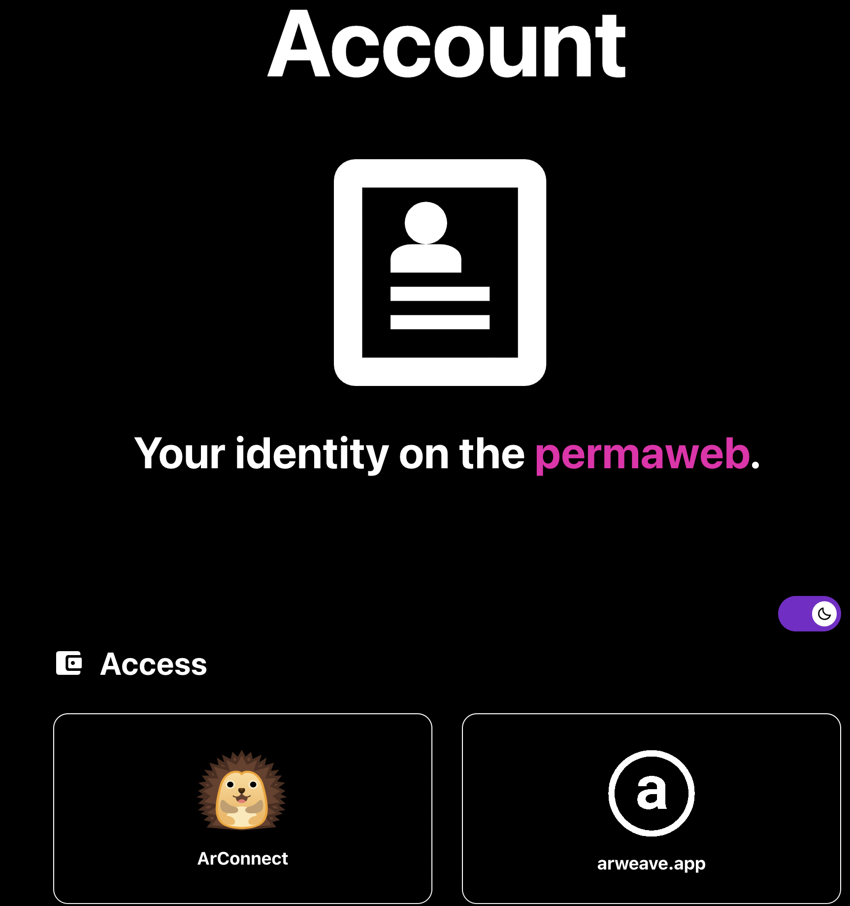
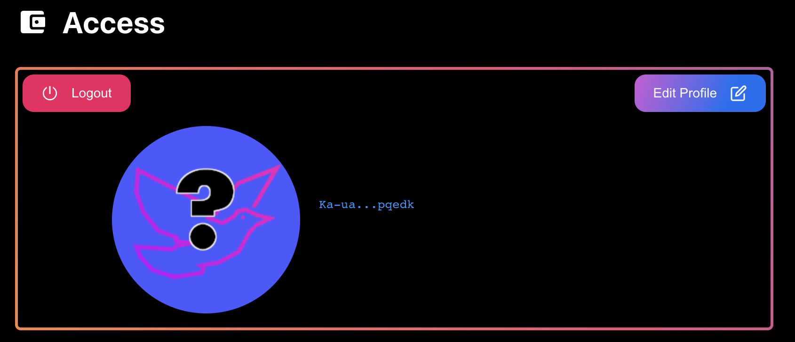
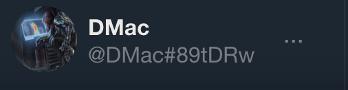

# Integrating arweave-account
What we have so far is the basic functionality of a twitter-like application, but it won't really feel "alive" until we're seeing real usernames and profile images.

To that end we are going to integrate an existing protocol for wallet address profiles called `arweave-account`. Arweave account is another ecosystem project/protocol that describes a transaction format and tags for account profile information. Any dApp building on arweave is free to query for these transactions and read the wallets profile information including name, handle, and profile image URL.

First we’ll want to install the `arweave-account` package from npm.
```
npm install arweave-account
```

You can learn more about `arweave-account` on its [www.npmjs.com/package/arweave-account](https://www.npmjs.com/package/arweave-account) page.

First we initialize an instance of `Account` in a single module so we can import it anywhere else in our code that we want to reference account info.

Open up `lib/api.js` file and add the following `import` at the top of the file (right below the Arweave import).

```js
import Account from 'arweave-account';
```

Then right below the Arweave initialization, add the initialization for `arweave-account`.

```js
export const account = new Account({
    cacheIsActivated: true,
    cacheSize: 100,
	cacheTime: 3600000  // 3600000ms => 1 hour cache duration
  });
```
We're telling `arweave-account` that we want to use caching, which will store account profiles we've loaded (in localstorage) for 1 hour. This limits the amount of redundant graphQL queries we do for account info lookups. If we run too many graphQL queries we'll run the risk of getting rate limited by the gateway and seeing a HTTP Status code of 429.

Next up we want to add the `<ProfileButton>` component to our dApps navigation panel. Head over to the `App.js` file and add the `<ProfileButton>` component right below the `<WalletSelectButton>`

```xml
  <div id="app">
    <div id="content">
      <aside>
        <Navigation />
          <WalletSelectButton setIsConnected={value => setIsWalletConnected(value)} />
          <ProfileButton isWalletConnected={isWalletConnected} />
```
We'll also pass our `isWalletConnected` as a `props` argument to the component. This allows the profile button to control its visibility so it only shows when the user is signed in.

The final step is to add the account lookup to the `<ProfileButton>` `React.useEffect` so it only loads the account when the `isWalletConnected` property changes to `true`.

Navigate your editor over to the `ProfileButton.jsx` file and populate the `React.useEffect` function with the followiong code.

```js
React.useEffect(() => {
  if (props.isWalletConnected) {
    const getAccount = async () => {
      const activeAddress = await window.arweaveWallet.getActiveAddress();
      const info = await account.get(activeAddress);

      if (info.profile?.name?.length > 0) {
        setName(info.profile.name);
        setHandle(info.handle);
        setSrc(info.profile.avatarURL);
      } else {
        setName(info.handle);
        setHandle("edit account");
        setSrc("img_avatar.png");
      }
    }

    getAccount();
  } else {
    setName("");
    setHandle("");
    setSrc("");
  }
}, [props.isWalletConnected]);
```

Lets break it down, first we check if `props.isWalletConnected` is true. If it is we know we need to retrieve the account for the wallet that's currently connected. We do all this in `React.useEffect` so that this code only executes every time `props.isWalletConnected` changes and not every time the component renders.

If a wallet is connected, we declare a new async function th get the `activeAddress` from the wallet  and use that to try and retrieve wallet profile information from `account.get(activeAddress)`. If the `profile.name` property is longer than 0 characters in length, we know the wallet has an `account`. So we display the accounts profile information by setting the `useState` properties already defined in the component. Otherwise we set the properties to some default values.

Finally we invoke our `getAccount();` function so it can run this logic when `props.isWalletConnected` changes. 

Time to test it out. Run the app and sign in with your wallet. When you do you should see something similar to the following in the bottom left corner of the UI.


Clicking on it will bring you to the arweave account editing page. This is a seperate dApp, permanently deployed to arweave that allows you to edit your wallets profile information. Any permaweb app that wants to can read this info from the weave and display your handle and profile image inside the app.

[Arweave Account](https://acount.metaweave.xyz) ([permalink](arweave.net/BYn976Gt4S4u-Kn7D0QxFLGlbko2GbHdJPVkZ_o2uGU))

Click the `Profile Button` in our dApp to open up a new tab with the `arwaeve-account` site loaded.



Click one of the wallet buttons to sign in.



Once signed in, you'll see your current account profile displayed. If you've never set up an arweave account for your wallet you'll see something like the above.

Click the `Edit Profile` button.

On the popup you'll be able to edit your profile information, upload an image and create a handle. Once done click the `Save` button at the bottom. (Note: You will need a small amount of AR in your wallet)

Now, return to our dApp, refresh the page and sign in with your wallet again. This time you should see your account information displayed on the `Profile Button`.



Excellent, now that we've integrated `arwaeve account` for our own wallet. Lets load profile images and handles for all the posts in our timeline.

# Displaying account profiles on posts

The first question to ask when considering how to display profile info with each post is "Where should we load the data?". In our case the best place is probably the `createPostInfo()` function in the `lib/api.js` file. Because we already kick off an `async` request for the posts message data, it would make sense to also kick off an account info request for the posts owner.

Lets make that change now... edit the code that creates our `postInfo` object and add `account: account.get(ownerAddress)` as shown in the following.

```js
const postInfo = {
    txid: node.id,
    owner: ownerAddress,
    account: account.get(ownerAddress),
    topic: topic,
    height: height,
    length: node.data.size,
    timestamp: timestamp,
    request: null,
  }
```

That's it! thats all we need to do to kick off loading of account profile for the post owner. The tricky part is waiting for the account profile to load before displaying it on the post in our timeline.

To do that we'll need to edit the `<Posts>` component. Open up the `Posts.jsx` file and lets make those changes.

At the beginning of the `PostItem` component, before all the existing functionality, insert the following code.

```js
const getAccountInfo = async () => {
  setOwnerName(abbreviateAddress(props.postInfo.owner));
  const info = await props.postInfo.account;
  setOwnerName(info.handle);
  if(info.handle[0] == '@') {
    props.postInfo.imgSrc = info.profile.avatarURL;
    setImgSrc(info.profile.avatarURL);
    setOwnerName(info.profile.name);
    setOwnerHandle(info.handle);
  } 
}
getAccountInfo();
```
(If you ever want to just look at the completed code, there's a finished branch of the project that contains the full app sorce code  up on github  [public-square-app/finished](https://github.com/DanMacDonald/public-square-app/tree/finished).)


Here we decare an `async` `getAccountInfo` function and use it to wait for our `postInfo.account` property to finish loading.

Right before we wait for it to complete we use the `setOwnerName(...)` function to initialize the `ownerName` variable to an abbreviated form of the owner address. This is useful for reducing "pop-in" and being able to show something immediately even while we're waiting for the account profile info to be retrieved.

In the case where there's no account set for the owner address, we'll just continue to use this abbreviated address as the `ownerName`. If there is an account, the `info.handle` property will start with the `@` character. In this case we want to fully initialize the variables that control display of the accounts handle and profile image. As part of this we cache the `imgSrc` URL in the `props.postInfo.imgSrc` so we can use it right away the next time the post is displayed.

Finally we call `getAccountInfo()` to kick off the account loading. 

Now when we re-load the dApp we should see profile images and account names appearing beside posts by owners who have setup their `arweave account`.


| No account | With arweave-account|
|--------|------|
|||

Next up, we do some finishing touches to round out the usability and publish our dApp permanently on Arweave!


| Previous | Next |
| -- | -- |
| [03 Posting Transactions](03-PostingTransactions.md)| [05 Polishing and Deploying](05-PolishingAndDeploying.md#polishing-and-deploying)