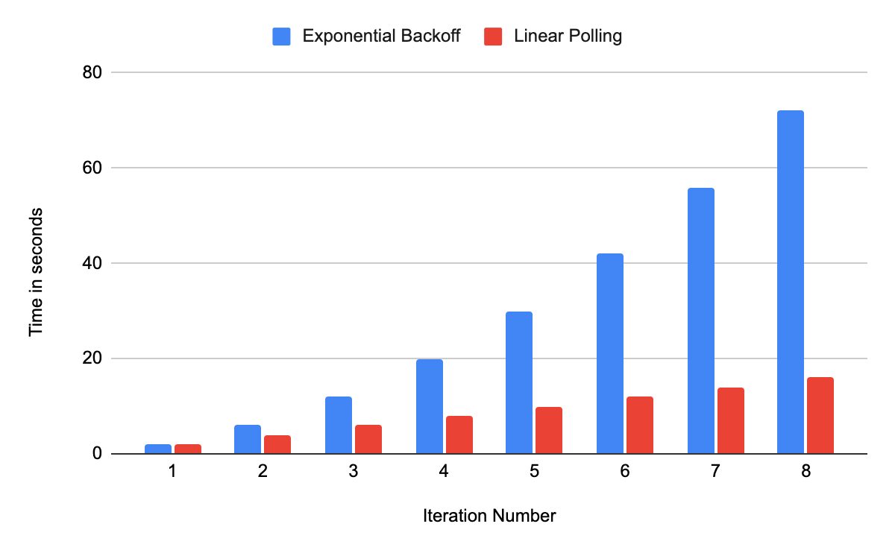
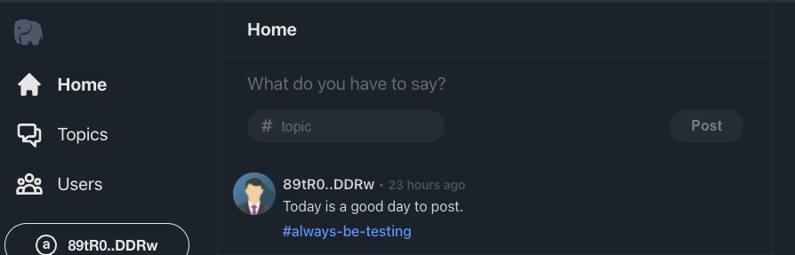
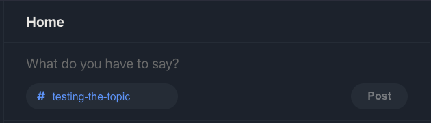
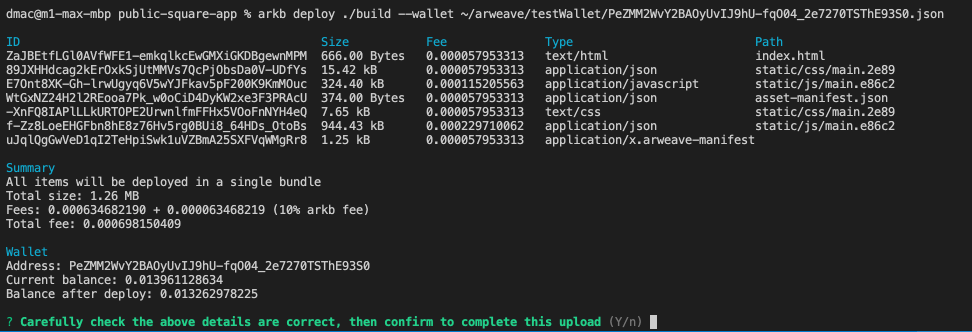
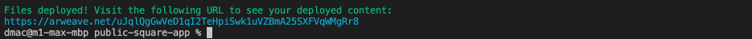

# Polishing and Deploying
Next up we'll be implementing a few features that bring our app much close to being finished and having a viable, self contained, featureset.

## Polling for updates
Now that we’re dispatching new posts to arweave, it would be nice if we could view the new tweet in the timeline without having to refresh manually in the browser repeatedly until it appears at the gateway.

To accomplish that we’re going to poll the gateway until the new transaction appears. A naive implementation would be to spam GraphQL queries at the gateway one after the other generating a lot of wasteful requests. Aside from being wasteful there’s some good reasons not to do that, the https://arweave.net gateway has rate limiting in place that limits the number of graphQL queries you can make every 5 minutes. Hammering it this way may cause it to start rejecting your requests, disabling the app.

To avoid being rate limited we’re going to use a simple form of [exponential backoff](https://en.wikipedia.org/wiki/Exponential_backoff) when polling the gateway.

Open up `src/App.js` and add a new function at the top of the file below the imports.

```js
async function waitForNewPosts(txid) {
 let count = 0;
 let foundPost = null;
 let posts = [];
 
 while (!foundPost) {
   count += 1;
   console.log(`attempt ${count}`);
   await delay(2000 * count);
   posts = await getPostInfos();
   foundPost = posts.find(p => p.txid === txid);
 }
 
 let i = posts.indexOf(foundPost);
 posts.unshift(posts.splice(i,1)[0]);
 return posts;
}
```

We’ll take as a parameter the transaction id of the post we dispatched. We’ll continue to query graphQL until it shows up and we can confirm arweave knows about the transaction.

First we set up some working variables that we’ll need to accomplish our goal. Next we set up a `while` loop that continues to loop until we find a `postInfo` with a txid  that matches the transaction id passed into our function.

Aside from posting a graphQL query to the gateway via `getPostInfos()` , the other function this loop implements is our simplified exponential backoff function. Each loop iteration we increment our count variable and use it to calculate how much time to delay before calling `getPostInfos()` again.

Below is a graph of the number of seconds of delay for each iteration of the loop indicated with blue bars. The red bars show what a linear polling cycle would look like if we polled every 2 seconds. You can see how by the 20 second mark linear polling would have made 8 calls, but our exponential backoff (backing off +2 seconds each attempt) would have only made 4. Those 4 calls would have been almost as responsive as linear polling early on, but backed away if the gateway was slow to respond. This reduces the chance of running headlong into rate limiting and also gives the gateway some breathing room if it’s experiencing heavy load.



Back to the `waitForNewPosts()` function. When `getPostInfos()` returns with results from GraphQL, we search them to see if we can locate our new transaction.
```js
foundPost = posts.find(p => p.txid === txid);
```


Our `find()` looks through all the `postInfo`’sreturned by `getPostInfos()` and looks to see if any of them have the transaction id (`txid`) we’re looking for. If so, it gets assigned to `foundPost`, causing the loop to exit.

Lastly because there may be several pending posts (those with a `height` of -1) the sort order returned by  `getPostInfos()` might not put the one we’re looking for at the top of the list. So we `splice`() our `foundPost` out of the list and `unshift()` it to the beginning, forcing it to display as the first post in our timeline.
Now it’s time to get it wired up.

The `<NewPost />` component will call `onPostMessage()` when it dispatches a new transaction to arweave, but we want to refresh our postInfos state all the way back up in our App component. So, we’ll have to do the plumbing to get that event back up to the App component. Starting in App, add a function right below the react state declarations to handle the event.

```js
async function waitForPost(txid) {
   setIsSearching(true)
   let posts = await waitForNewPosts(txid);
   setPostInfos(posts)
   setIsSearching(false);
 }
```

There are a number of ways to handle this, but for the purposes of this tutorial we’ll show the progress spinner while the exponential backoff function ( `waitForNewPosts()` ) is waiting. Once it completes we’ll update our `postInfos` in React and toggle the spinner off. 

Locate the declaration of the `<Home />` component and add the following `onPostMessage={waitForPost}` the full declaration should look something like this. 

```js
<Home
 isWalletConnected={isWalletConnected}
 isSearching={isSearching}
 postInfos={postInfos}
 onPostMessage={waitForPost}
/>}
```

Now we need to pass that same property on to `<NewPost />`. Locate the Home component function that declares `<NewPost />` and modify its properties to look like this.
```js
<NewPost 
 isLoggedIn={props.isWalletConnected} 
 onPostMessage={props.onPostMessage}
/>
```

It’s time to test!

Switch to the browser tab containing the dApp, open the developer tools so you can watch the console log. Then post a message and observe the polling in action. It should take a couple of queries before the new post shows up, but once it does it should appear at the top of the timeline, the spinner should hide, and the new Post component should be reset (and editable again).

# Adding protocol features
One of the exciting things about using existing protocols built on arweave is that they are open and permissionless. You are free to build on top the existing tags/transactions adding some of your own. This way you can incrementally increase the functionality of the protocol without breaking any existing apps.

In twitter hashtags are an important feature that enable users to organically create categories of tweets. The original [Public Square](https://gist.github.com/samcamwilliams/811537f0a52b39057af1def9e61756b2) protocol doesn’t make any mention of categorizing posts, but that doesn’t mean we can’t add it!

Let’s add the ability for users to add a “topic” to their post (carefully avoiding the word “Hashtag” which some large corporation has no doubt trademarked)

These “topics” will be clickable links like hashtags that filter out any post that doesn’t include that topic. To keep things simple and organized we’ll allow just one topic per post.

## Displaying a Topic Link

Head over to `src/components/Posts.jsx` and modify the `<PostItem />` component. Right after our existing `React.useEffect(() => {` function we added back in the [Handling asynchronous state](02-IntegratingArweaveJS.md#handling-asynchronous-state) section, add the following function.
```js
const renderTopic = (topic) => {
 if (topic)
   return (<Link to={`/topics/${topic}`} className="postTopic">#{topic}</Link>)
}
```

Then, a little lower in the file right after the “postRow” div, add this line
```js
{renderTopic(props.postInfo.topic)}
```

This will add a React `<Link />` component to our post view if props.postInfo.topic is defined. This means we need to modify the `createPostInfo()` function to include support for a topic tag.
Open up `src/lib/api.js` where we can make that change. Somewhere in the top section of `createPostInfo()` add the following declarations.

```js
const topicTag = node.tags && node.tags.find((a) => a.name === 'Topic');
const topic = topicTag ? topicTag.value : null;
```

This code attempts to locate a ‘Topic’ tag in the tags array and initialize a topic variable with its value if the tag is found.
Next, update the postInfo declaration to include a topic field. The final declaration should look something like this.
```js
 const postInfo = {
   txid: node.id,
   owner: ownerAddress,
   topic: topic,
   height: height,
   length: node.data.size,
   timestamp: timestamp,
   request: null,
 }
```

If you test the app now you may notice that suddenly your timeline contains posts with topics. That’s because other people doing this tutorial before you have made this change and posted transactions with the topic tag.

If you click a topic link, you’ll see it redirects to the topics section of the dApp but it’s not filtering properly (it is changing the URL correctly though). Don’t worry we’ll fix that in the next section, [Dynamic Queries](#dynamic-queries). Before we do that though, let’s add the ability to specify a topic in the `<NewPost />` component.

Navigate your code editor back to `src/components/NewPost.jsx` and add the following React state to the top of NewPost (alongside postValue and isPosting).
```js
const [topicValue, setTopicValue] = React.useState("");
```
This is where we’ll store the post topic so we can set up a ui that rebinds anytime topicValue changes.

Below that we need to add a helper function to validate our topic input to only allow alphanumeric characters and dashes.
```js
function onTopicChanged(e) {
 let input = e.target.value;
 let dashedTopic = getTopicString(input);
 setTopicValue(dashedTopic);
}
```

Next uncomment the “topic” divs that are the first child of `<div className="newPost-postRow">`. These exist in two places, one with an onChange handler for the active form, the other with `disabled={true}` for the disabled form. After uncommenting the code will be enabled like this…

```html
<div className="topic"
 style={{color: topicValue  && "rgb( 80, 162, 255)" }}
>
 #
 <input
   type="text"
   placeholder="topic"
   className="topicInput"
   value={topicValue}
   onChange={e => onTopicChanged(e)}
 />
</div>
```

Now when you sign into the dApp with your wallet you’ll see a place to enter a topic in the NewPost view.



And when you input a topic it should do input validation and highlight the text.



Finally let’s make sure any topic the user inputs is added to the transaction as a custom tag to the transaction.

Scroll up to the `onPostButtonClicked()` function and add the following lines of code below where we specify the other transaction tags.
```js
if(topicValue) {
  tx.addTag('Topic', topicValue);
}
```

This way we only add the "Topic" tag if the user provided a topic value.
That’s it, we’re done.

Try a test post to see if your topic shows up in the timeline.

Next up, it’s time to fix those topic links!

# Dynamic Queries
GraphQL queries are pretty easy to parameterize. We can modify our existing `buildQuery()` function in `src/lib/api.js` to take a few arguments to further filter the results. Modify the beginning of the `buildQuery()` function to look like this.
```js
export const buildQuery = ({count, address, topic} = {}) => {
  count = Math.min(100, count || 100);
  let ownersFilter = '';
  if (address) {
    ownersFilter = `owners: ["${address}"],`
  }
 
  let topicFilter = '';
  if (topic) {
    topicFilter = `{
      name: "Topic",
      values: ["${topic}"]
    },`
  }
 
  const queryObject = { query: `{
    transactions(first: ${count}, ${ownersFilter}
      tags: [
        {
          name: "App-Name",
          values: ["PublicSquare"]
        },
        {
          name: "Content-Type",
          values: ["text/plain"]
        },
        ${topicFilter}
      ]
    )
   ...
 ```

These arguments allow us to filter the query results in three important ways.

* We can specify a count argument that will limit the results to a specific number. By default it will default to 100 (the maximum the arweave.net/graphql endpoint will return) if no count is provided. You can see more documentation on how the first parameter works as well as [pagination and cursors](https://gql-guide.vercel.app/#pagination) in the graphQL guide.

* Specifying an address argument will filter the results limiting them to only those transactions owned by a particular address. You can read more about [owners address filtering](https://gql-guide.vercel.app/#owners) here.

* Finally a topic argument will enable us to limit the results to only those transactions with a “Topic” tag whose value matches our argument. You can read more about [filtering by tags](https://gql-guide.vercel.app/#tags) here.

Then, open up `src/App.js` and modify our `getPostInfos()` function so it can pass through address and topic values as query filters.
```js
async function getPostInfos(ownerAddress, topic) {
 const query = buildQuery({address: ownerAddress, topic});
```

Poof! Now when we go back to the browser and click on users wallet addresses or topic links it takes us to a page with filtered results. How? Well we cheated a bit, the `<TopicResults />` and `<UserResults />` components in the sample project have been passing ownerAddress and topic filters as arguments  to `getPostInfos()` the whole time. Until we added these parameters javascript was just ignoring them. 

The React implementation is all there in `src/App.js` for you to inspect if you’re curious.
# Integrating Avatars
`<Coming soon>`

# Deploying to Arweave
Finally, we’ve got a working application but it’s just on our machine, we want to deploy it permanently on arweave making it fully decentralized. 

How do we do it?

First if you're still running the app in development mode, hit `ctrl+c` to cancel it.
Next run the build command with.
```
npm run build
```


This will make a production version of the app in a build directory. Next up, it’s time to run some arweave tooling to deploy our build.
While there are other options, for this guide we are going to use a tool called `arkb`.
```
npm install -g arkb
```

`arkb` will allow us to deploy our build directory to arweave. Each file will become its own transaction posted to arweave. On top of that arkb takes advantage of a gateway feature that allows for users to post a path manifest. [Path Manifest](https://github.com/ArweaveTeam/arweave/blob/master/doc/path-manifest-schema.md) files link separate transactions together at a “root” transaction and tells the gateway to treat them as though they are all relative to a single base path. Other than knowing this is how the gateway is able to collect a bunch of disparate transactions into a single path to serve as a site, there’s not much more for us to do. Arkb takes care of the rest.

Time to deploy our app!
```
arkb deploy ./build --wallet ~/arweave/testWallet/PeZMM2...hE93S0.json
```

The wallet file name has been abbreviated here to fit nicely into one line, but when you run specify the wallet path you’d use the fully qualified name for your wallet file. It does cost to deploy to arweave so make sure you have some AR tokens in that wallet.

Upon running the command you should be presented with a summary of the files to be uploaded.



There may be more or less files depending on if you’ve uploaded before. Arkb makes every attempt not to post files that have already been. Instead it builds a new path manifest that links to the existing file. 

Once deployed you’ll get a confirmation



The link provided links to the path manifest file transaction. Following this link will load up our public square app, permanently deployed on arweave. (after a minute or two for the file bytes and manifest to be processed at the gateway)

You’ll notice that the gateway will redirect you to an odd looking url. Something like this https://kgjsyynbuvuqokiydalbxatpg6icwwk2fjyqhu3zlr2dnliaqzxq.arweave.net/UZMsYaGlaQcpGBgWG4JvN5ArWVoqcQPTeVx0Nq0Ahm8/ . It’s the same transaction id, but now it’s being served from a unique subdomain of arweave.net.  This is for security reasons, if all sites/dApp deployed to arweave were served from the same arweave.net domain then they would all share a **localStroage** cache in the browser. This would give a malicious dApp access to data stored by a benevolent app. **So, in order to preserve the security sandbox for each dApp, arweave.net redirects each transaction to their own unique subdomain.**

Thats it. You're done. You now have your own decentralized, permanently deployed front end to the Public Square protocol on arweave. You can take the shortened version of the link that `arkb` printed out and send it to your peers to see what they think.

The version I deployed creating this tutorial is deployed here...

https://arweave.net/2SFFgIDj9lc1GSwnrR-nhMaYGCPpz6q9KqFpO5g6C3I/

Welcome to the permaweb🐘
 
 -DMac

 | Previous | Overview |
| -- | -- |
| [03 Posting Transactions](03-PostingTransactions.md#posting-transactions) | [README.md](README.md#topics)

